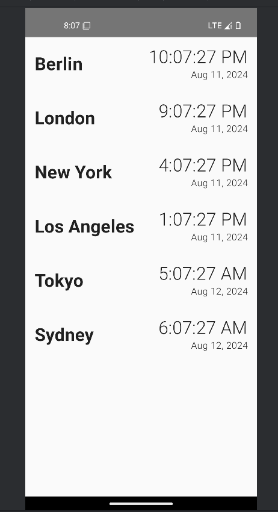
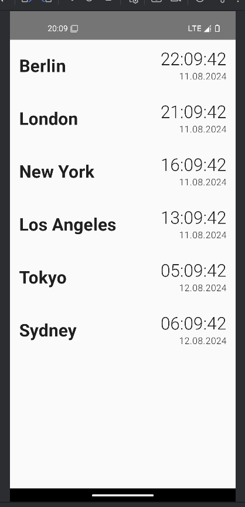
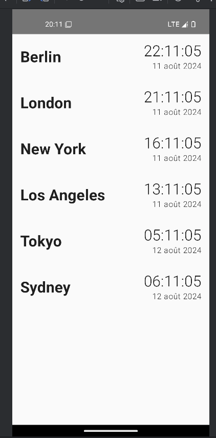
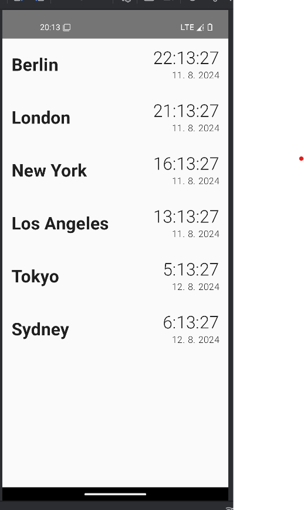

This is a Kotlin Multiplatform project targeting Android, iOS, Desktop.

* `/composeApp` is for code that will be shared across your Compose Multiplatform applications.
  It contains several subfolders:
  - `commonMain` is for code that’s common for all targets.
  - Other folders are for Kotlin code that will be compiled for only the platform indicated in the folder name.
    For example, if you want to use Apple’s CoreCrypto for the iOS part of your Kotlin app,
    `iosMain` would be the right folder for such calls.

* `/iosApp` contains iOS applications. Even if you’re sharing your UI with Compose Multiplatform, 
  you need this entry point for your iOS app. This is also where you should add SwiftUI code for your project.

Learn more about [Kotlin Multiplatform](https://www.jetbrains.com/help/kotlin-multiplatform-dev/get-started.html)…

## Recommendation

Why you should use standard formatters, because every locale uses different style for date/time, like spacing, 12/24 format, etc...

This result is from same code with different locales (US, DE, FR, CS):

US: uses 12h format, `MM dd, yyyy`, comma and space as date separator.

DE: uses 24h format, `dd.MM.yyyy`, dot as date separator.

FR: uses 24h format, `dd MMM yyyy`, space separator for date.

CS: uses 24h format, `dd. MM. yyyy`, dot and space as date separator.

Please respect regional settings and use standard formatters if you return output for users :).